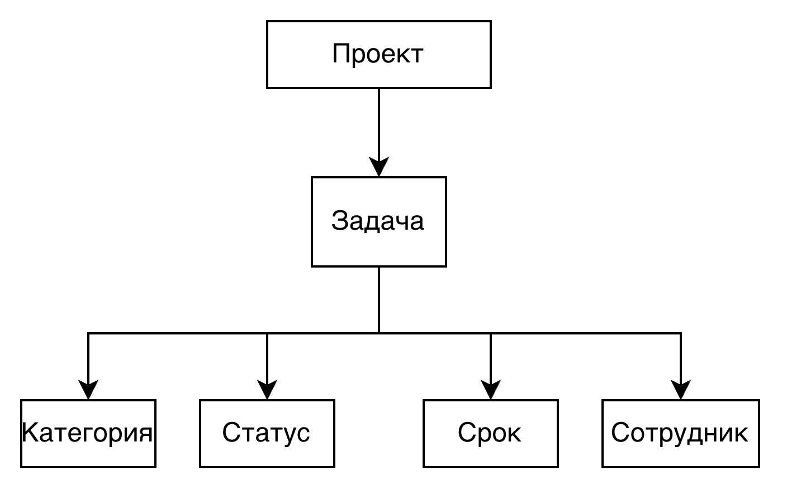

# Отчет по лабораторной №1

# Задание

Вариант 0. Система управления задачами команды (демонстрационный)

Система предназначена для организации работы небольшой команды над проектами. Пользователи должны иметь возможность создавать проекты и задачи, назначать ответственных, устанавливать сроки и отслеживать состояние выполнения. Руководитель команды должен иметь возможность контролировать загрузку сотрудников и ход выполнения задач.

## Проблема и цель
Проблема: заявки сотрудников на техническую поддержку поступают по разным каналам и не имеют единого учета, из-за чего сложно контролировать их обработку.

Цель: разработать информационную систему для централизованной регистрации, обработки и контроля заявок сотрудников.

Область применения: система предназначена для использования в службе технической поддержки организации для регистрации и обработки обращений сотрудников.

## Объекты предметной области

- Проект
  - Задача
    - Срок
    - Статус
- Комментарий
- Исполнитель

##  Роли и пользователи

| Роль          | Назначение                                                       | Основные действия |
|---------------|------------------------------------------------------------------|-------------------|
| Администратор | Добавление пользователей, назначение ролей, управление проектами |                   |
| Руководитель  | Создание проектов, назначение задач, контроль выполнения         |                   |
| Исполнитель   | Просмотр задач, выполнение задач, добавление комментариев        |                   |

## Функциональные требования

Система должна позволять:
- Создавать проекты.
- Редактировать проекты.
- Удалять проекты.
- Создавать задачи.
- Редактировать задачи.
- Удалять задачи.
- Назначать ответственных за задачи.
- Устанавливать сроки выполнения задач.
- Отслеживать состояние выполнения задач.
- Добавлять комментарии к задаче.
- Управлять пользователями и их ролями.
- Генерировать отчеты о выполнении задач и загрузке сотрудников.
- Менять статусы задачам.

## Концепция ИС

Система представляет собой веб-приложение, доступное через браузер.
Пользователи могут регистрироваться и входить в систему с использованием учетных данных.
После входа пользователи видят список проектов и задач, назначенных им или их команде.
Руководители могут создавать новые проекты и задачи, назначать ответственных и устанавливать сроки выполнения.
Исполнители могут просматривать свои задачи, изменять их статусы и добавлять комментарии.

Основные компоненты:
- Веб-интерфейс для взаимодействия с пользователями.
- Серверная часть для обработки запросов и управления данными.
- База данных для хранения информации о проектах, задачах, пользователях и комментариях.
- API для взаимодействия между веб-интерфейсом и серверной частью.
