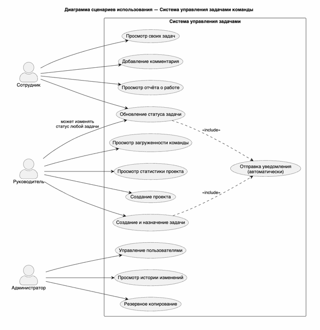
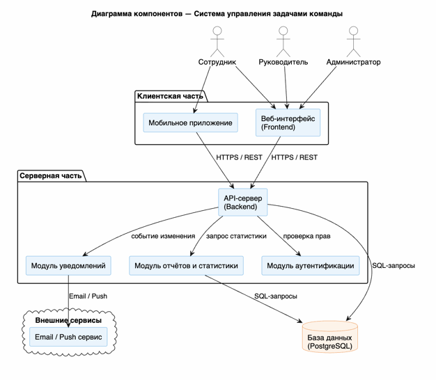

# Лабораторная работа №2
## Проектирование информационной системы

### Цель работы

Изучить основные этапы проектирования архитектуры информационной системы, определить компоненты, описать сценарии использования и разработать схему взаимодействия компонентов.

---

## Краткое описание выполненного задания

На основе предметной области «Система управления задачами команды» (из лабораторной работы №1) была спроектирована информационная система.

**Решаемая проблема:**
Команде необходима централизованная система для управления проектами и задачами, отслеживания прогресса, контроля загруженности сотрудников и автоматического напоминания о сроках.

**Основные сущности:**
- Проекты, Задачи, Сотрудники, Комментарии, Статусы, История изменений

---

## Основные результаты работы

### 1. Пользователи и роли

| Роль | Назначение | Основные действия |
|------|-----------|------------------|
| **Сотрудник** | Выполнение задач | Просмотр своих задач, изменение статуса, добавление комментариев |
| **Руководитель** | Управление проектами и контроль | Создание проектов и задач, назначение ответственных, просмотр статистики |
| **Администратор** | Управление системой | Управление пользователями, настройка прав, просмотр всех данных |

### 2. Сценарии использования (6 основных)

1. **Создание проекта** — Руководитель создаёт новый проект с названием, описанием и датами
2. **Создание и назначение задачи** — Руководитель создаёт задачу в проекте и назначает её сотруднику
3. **Обновление статуса задачи** — Сотрудник меняет статус задачи (Новая → В процессе → Завершено)
4. **Просмотр загруженности** — Руководитель видит, сколько активных задач у каждого сотрудника
5. **Просмотр отчёта о работе** — Сотрудник видит историю своих завершённых задач и затраты времени
6. **Просмотр статистики проекта** — Руководитель видит процент завершения, просроченные задачи, прогресс

### 3. Компоненты системы

| Компонент | Описание |
|-----------|---------|
| **Веб-интерфейс (Frontend)** | Интерфейс для просмотра задач, доски проектов, статистики |
| **API-сервер (Backend)** | Обработка запросов, проверка прав, валидация данных |
| **База данных** | Хранилище проектов, задач, сотрудников, истории изменений |
| **Система аутентификации** | Проверка пользователя и его роли |
| **Система уведомлений** | Email/Push напоминания о сроках и изменениях |
| **Модуль статистики** | Расчёт прогресса, загруженности, построение графиков |

---

## Диаграммы и схемы

### Диаграмма сценариев использования (Use Case)



**Исходник:** [`diagrams/src/use-cases.puml`](./diagrams/src/use-cases.puml)

### Диаграмма компонентов архитектуры



**Исходник:** [`diagrams/src/architecture.puml`](./diagrams/src/architecture.puml)

### Диаграмма взаимодействия (сценарий: создание задачи)

---

**Структура проекта:**
```
lab2/
├── README.md
└── diagrams/
    ├── images/
    │   ├── use-cases.png
    │   └── architecture.png
    └── src/
        ├── use-cases.puml
        └── architecture.puml
```