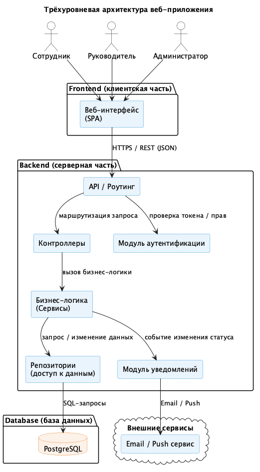
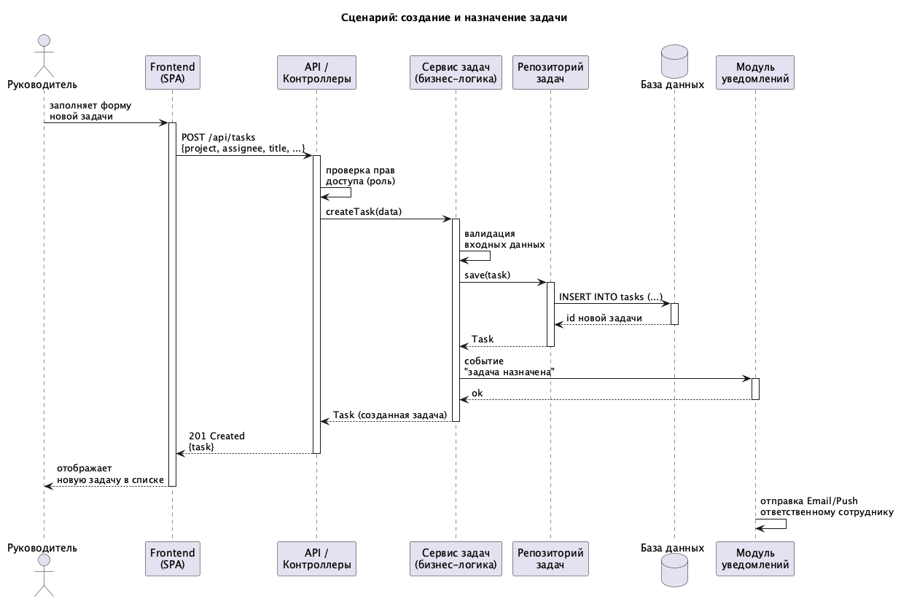

# Лабораторная работа №3
## Проектирование архитектуры информационной системы

### Цель работы

Изучить принципы проектирования архитектуры информационных систем, определить структуру приложения, спроектировать взаимодействие между основными компонентами и подготовить структуру программного проекта для дальнейшей разработки.

---

## Краткое описание выполненного задания

На основе предметной области «Система управления задачами команды» (лабораторные работы №1–2) спроектирована архитектура информационной системы: выбран архитектурный стиль, определены компоненты и их ответственность, описано взаимодействие компонентов на примере одного сценария, разработана структура каталогов проекта, а также выделена и отражена в архитектуре индивидуальная нетиповая особенность предметной области — уведомление ответственного сотрудника о задачах.

---

## Основные результаты работы

### 1. Архитектурный стиль

Выбрана **трёхуровневая архитектура веб-приложения** (3-tier architecture):

| Уровень | Назначение |
|---|---|
| **Frontend (клиентская часть)** | Отображение интерфейса, взаимодействие с пользователем, отправка запросов к API |
| **Backend (серверная часть)** | Обработка запросов, бизнес-логика, проверка прав доступа, работа с данными |
| **Database (база данных)** | Постоянное хранение данных о проектах, задачах, сотрудниках |

**Преимущества подхода:** разделение ответственности между уровнями, возможность независимой разработки и масштабирования каждого уровня, упрощённое тестирование бизнес-логики отдельно от интерфейса и хранилища данных.

### 2. Компоненты системы

| Компонент | Назначение и ответственность |
|---|---|
| **Веб-интерфейс (Frontend)** | Отображение проектов, задач, форм; отправка запросов к API |
| **API / Роутинг** | Приём HTTP-запросов, определение маршрута обработки |
| **Контроллеры** | Разбор запроса, вызов нужного сервиса, формирование ответа |
| **Бизнес-логика (Сервисы)** | Валидация данных, бизнес-правила (например, кто может назначать задачи) |
| **Репозитории** | Доступ к данным: чтение и запись в базу данных |
| **Модуль аутентификации** | Проверка личности пользователя и его роли |
| **Модуль уведомлений** | Отправка Email/Push уведомлений об изменениях в задачах |
| **База данных (PostgreSQL)** | Хранение проектов, задач, сотрудников, истории изменений |

### 3. Взаимодействие компонентов

Общая последовательность обработки запроса пользователя:

1. Пользователь выполняет действие в веб-интерфейсе (например, создаёт задачу).
2. Frontend отправляет HTTP-запрос (REST/JSON) к API.
3. API проверяет права доступа через модуль аутентификации и передаёт запрос контроллеру.
4. Контроллер вызывает соответствующий сервис бизнес-логики.
5. Сервис валидирует данные и обращается к репозиторию для сохранения/чтения данных.
6. Репозиторий выполняет SQL-запрос к базе данных.
7. При необходимости сервис инициирует уведомление через модуль уведомлений (Email/Push).
8. Результат возвращается через API обратно на Frontend и отображается пользователю.

Подробная последовательность вызовов для сценария «создание и назначение задачи» показана на диаграмме взаимодействия (см. ниже).

### 4. Структура проекта

Подготовлена заготовка структуры каталогов будущего приложения (см. [`project/`](./project)):

```
project/
├── frontend/            # клиентская часть (SPA)
├── backend/
│   ├── controllers/     # обработка HTTP-запросов
│   ├── services/        # бизнес-логика
│   ├── repositories/    # доступ к данным
│   ├── models/          # модели данных
│   └── routes/          # маршруты API
├── database/            # миграции, схема БД
└── docs/                # техническая документация
```

### 5. Индивидуальная особенность предметной области

Помимо типовых CRUD-операций (создание/просмотр/изменение/удаление проектов и задач), в системе выделена нетиповая особенность — **уведомление ответственного сотрудника при назначении задачи или приближении срока её выполнения**.

Эта функция не сводится к простому запросу к базе данных: событие изменения задачи должно быть обработано отдельно от основного потока запроса и доставлено пользователю через внешний канал (Email/Push), не блокируя ответ API.

За реализацию данной особенности отвечает выделенный компонент **«Модуль уведомлений»** (см. пакет Backend на диаграмме архитектуры): сервис бизнес-логики при изменении статуса задачи передаёт событие модулю уведомлений, который формирует и отправляет сообщение через внешний Email/Push сервис. Место этого компонента в общем потоке обработки запроса также показано на диаграмме взаимодействия (шаг «событие "задача назначена"» → отправка Email/Push).

---

## Диаграммы и схемы

### Диаграмма архитектуры системы



**Исходник:** [`diagrams/src/architecture.puml`](./diagrams/src/architecture.puml)

### Диаграмма взаимодействия компонентов (сценарий: создание и назначение задачи)



**Исходник:** [`diagrams/src/interaction.puml`](./diagrams/src/interaction.puml)

---

## Вывод

В результате работы спроектирована архитектура информационной системы «Система управления задачами команды» на основе трёхуровневого подхода (Frontend / Backend / Database). Определены зоны ответственности каждого компонента, описано взаимодействие между ними на конкретном сценарии, выделена индивидуальная особенность предметной области (уведомления о задачах) и отвечающий за неё компонент, подготовлена структура каталогов будущего проекта. Полученные результаты формируют основу для реализации системы в последующих лабораторных работах.

---

**Структура репозитория:**
```
lab3/
├── README.md
├── project/              # заготовка структуры программного проекта
└── diagrams/
    ├── images/
    │   ├── architecture.png
    │   └── interaction.png
    └── src/
        ├── architecture.puml
        └── interaction.puml
```
