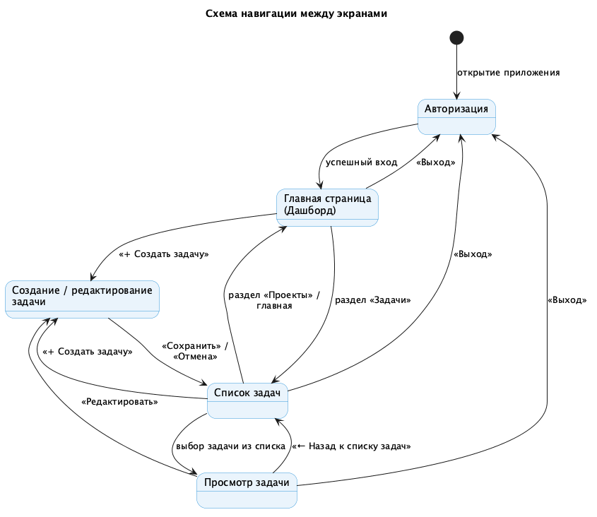
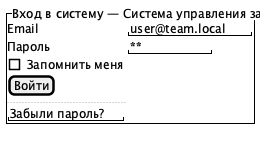
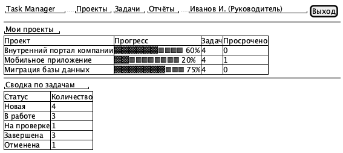
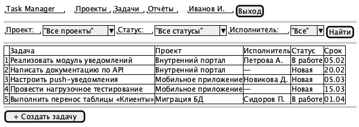
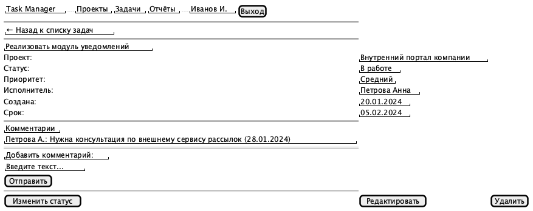
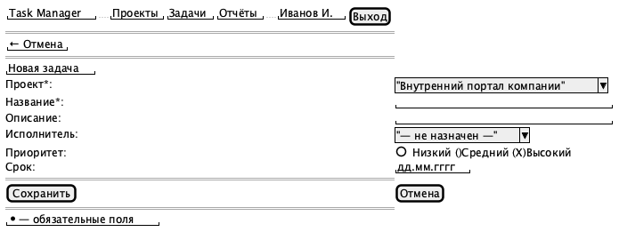

# Лабораторная работа №4
## Проектирование пользовательского интерфейса

### Цель работы

Изучить основные принципы проектирования пользовательских интерфейсов, разработать структуру экранов информационной системы, спроектировать навигацию и подготовить прототипы страниц.

---

## Краткое описание выполненного задания

На основе архитектуры информационной системы «Система управления задачами команды» (лабораторная работа №3) спроектирован пользовательский интерфейс: определены 5 экранов, описана навигация между ними, подготовлены wireframe-прототипы основных страниц.

При проектировании соблюдены базовые принципы UX/UI: единообразие оформления (общая шапка на всех экранах), понятная навигация, минимальное количество действий для основных операций, адаптация интерфейса под роль пользователя (Руководитель видит сводку по всем проектам).

---

## Основные результаты работы

### 1. Структура экранов

| № | Экран | Назначение | Основные элементы | Действия пользователя |
|---|---|---|---|---|
| 1 | **Авторизация** | Вход в систему | Поля email/пароль, чекбокс «Запомнить меня» | Войти, восстановить пароль |
| 2 | **Главная страница (Дашборд)** | Обзор проектов и сводка по задачам | Список проектов с прогрессом, сводка по статусам | Перейти к проекту, к списку задач |
| 3 | **Список задач** | Просмотр и фильтрация задач | Фильтры (проект/статус/исполнитель), таблица задач | Найти, открыть задачу, создать задачу |
| 4 | **Просмотр задачи** | Детальная информация о задаче | Атрибуты задачи, список комментариев, форма комментария | Изменить статус, редактировать, удалить, оставить комментарий |
| 5 | **Создание / редактирование задачи** | Ввод данных новой задачи | Форма: проект, название, описание, исполнитель, приоритет, срок | Сохранить, отменить |

### 2. Навигация между экранами

Навигация построена вокруг главной страницы (дашборда) как центральной точки — пользователь может попасть на неё из любого раздела через верхнее меню, а также перемещается между списком задач, карточкой задачи и формой создания/редактирования.



**Исходник:** [`diagrams/src/navigation.puml`](./diagrams/src/navigation.puml)

### 3. Прототипы страниц

Прототипы выполнены в низкодетализированном формате (Wireframe) с помощью PlantUML Salt — это позволяет быстро внести изменения и хранить макеты как текстовый код рядом с остальной документацией.

#### Экран 1. Авторизация


#### Экран 2. Главная страница (Дашборд)


#### Экран 3. Список задач


#### Экран 4. Просмотр задачи


#### Экран 5. Создание / редактирование задачи


Исходники всех прототипов — в [`design/src/`](./design/src).

---

## Вывод

В результате работы спроектирован пользовательский интерфейс информационной системы «Система управления задачами команды»: определена структура из 5 экранов, продумана навигация между ними, подготовлены wireframe-прототипы каждой страницы. Единая шапка навигации и последовательная логика переходов (дашборд → список → карточка → форма) обеспечивают предсказуемость и минимальное число действий для выполнения основных операций. Результаты готовы к использованию в качестве основы для вёрстки интерфейса.

---

**Структура репозитория:**
```
lab4/
├── README.md
├── diagrams/
│   ├── images/
│   │   └── navigation.png
│   └── src/
│       └── navigation.puml
└── design/
    ├── images/
    │   ├── 01-login.png
    │   ├── 02-dashboard.png
    │   ├── 03-task-list.png
    │   ├── 04-task-detail.png
    │   └── 05-task-form.png
    └── src/
        ├── 01-login.puml
        ├── 02-dashboard.puml
        ├── 03-task-list.puml
        ├── 04-task-detail.puml
        └── 05-task-form.puml
```
