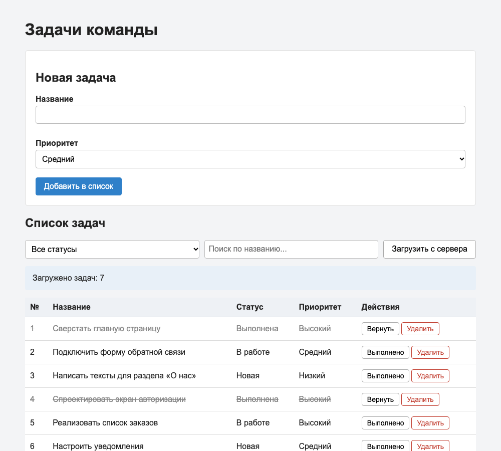
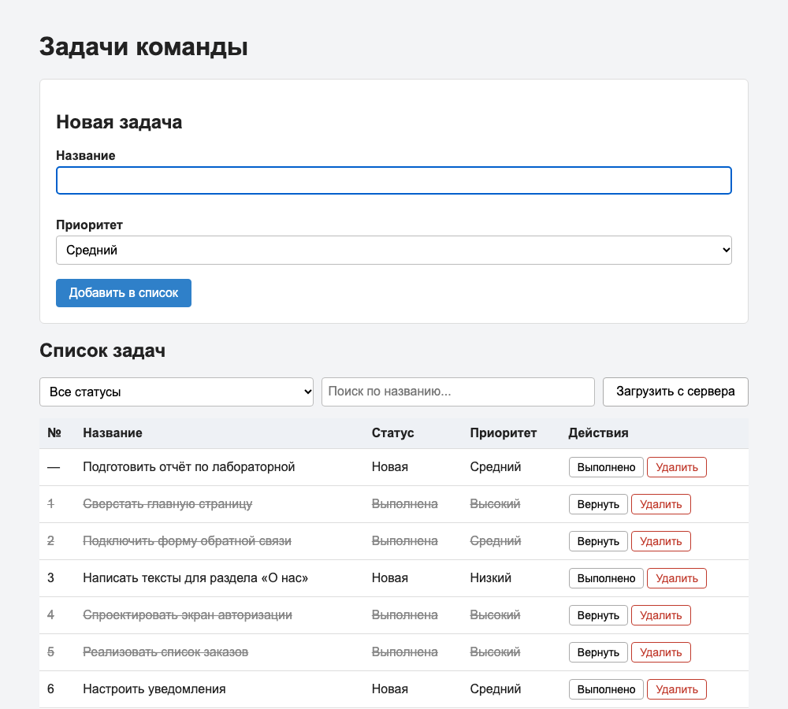
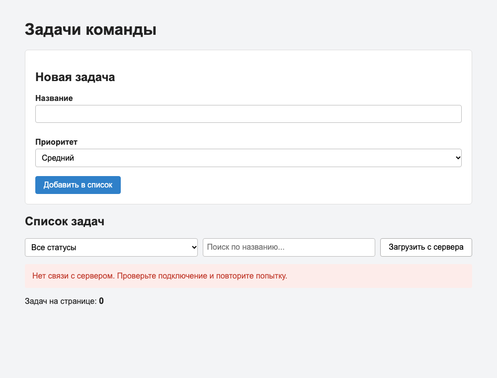

# Лабораторная работа №5
## Реализация клиентской логики

### Цель работы

Изучить основы разработки клиентской части веб-приложений, реализовать обработку пользовательских событий, взаимодействие с сервером посредством асинхронных запросов и динамическое изменение содержимого веб-страницы с использованием JavaScript.

---

## Краткое описание выполненного задания

На основе пользовательского интерфейса системы «Система управления задачами команды» (лабораторная работа №4) реализована клиентская логика на HTML, CSS и чистом JavaScript (без библиотек и фреймворков). Страница показывает список задач, позволяет искать и фильтровать их, добавлять новые, отмечать выполненными и удалять.

Серверной части пока нет, поэтому данные берутся из учебного сервера, который работает в браузере. В `src/js/mock-data.js` описаны массивы с данными (`tasks`, `users`) и таблица `ROUTES` («какой запрос — какие данные возвращает»), а `src/js/mock-api.js` — «движок», который перехватывает запросы `fetch` к адресам `/api/...` и отвечает как настоящий REST API (с задержкой, кодом ответа и JSON).

**Запуск:** открыть файл `src/index.html` в браузере двойным щелчком. Веб-сервер не требуется.

---

## Описание реализованной клиентской логики

Вся логика находится в файле `src/js/app.js`:

| Блок | Назначение |
|------|------------|
| поиск элементов страницы | `document.getElementById(...)` по `id` из `index.html` |
| `showInfo()`, `updateCounter()`, `addCell()` | вспомогательные функции для вывода сообщений, обновления счётчика и создания ячеек |
| `createTaskRow()` | создание строки таблицы для одной задачи |
| `onFormSubmit()`, `onDoneClick()`, `onDeleteClick()` | обработчики событий |
| `loadTasks()`, `refreshList()` | запрос к серверу и вывод полученных данных |

Страница работает по схеме «событие → действие → результат на странице»: пользователь выполняет действие, обработчик меняет содержимое страницы, перезагрузки страницы не происходит.



Список загружается автоматически при открытии страницы и повторно по кнопке «Загрузить с сервера».

---

## Описание обработки пользовательских событий

| Событие | Элемент | Что происходит |
|---------|---------|----------------|
| `submit` | форма «Новая задача» | отмена перезагрузки страницы (`preventDefault`), проверка названия (не короче 3 символов), добавление строки в таблицу, очистка формы |
| `click` | кнопка «Загрузить с сервера» | запрос к серверу и обновление таблицы |
| `change` | список «Все статусы» | запрос с выбранным статусом и обновление таблицы |
| `input` | поле поиска | запрос с введённым текстом и обновление таблицы |
| `click` | кнопка «Выполнено» / «Вернуть» в строке | задача отмечается выполненной или возвращается в работу |
| `click` | кнопка «Удалить» в строке | подтверждение и удаление строки со страницы |

Обработчики кнопок в строках подключаются в момент создания строки (`addEventListener` внутри `createTaskRow`), потому что строки появляются на странице динамически.

---

## Описание работы с DOM и асинхронными запросами

### Работа с DOM

| Операция | Где в коде | Пример |
|----------|------------|--------|
| создание новых элементов | `createTaskRow()`, `addCell()` | `document.createElement('tr')`, `appendChild`, `insertBefore` |
| удаление элементов | `onDeleteClick()` | `row.remove()` |
| изменение текста | `onDoneClick()`, `showInfo()`, `updateCounter()` | `cell.textContent = 'Выполнена'` |
| изменение атрибутов | `createTaskRow()`, `onDoneClick()`, `updateCounter()` | `row.setAttribute('data-id', ...)`, `button.setAttribute('title', ...)`, `table.hidden = true` |
| изменение классов оформления | `createTaskRow()`, `onDoneClick()` | `row.classList.toggle('done')` |

Весь текст, в том числе введённый пользователем, записывается через `textContent`, поэтому внедрить HTML-код через название задачи невозможно (проверено на строке `<b>Тест</b>`: она отображается как обычный текст).



На снимке добавлена новая задача (номер «—», пока она не сохранена на сервере) и кнопкой «Выполнено» отмечены задачи №2 и №5. Задачи №1 и №4 были выполнены в исходных данных. У всех выполненных строк добавлен класс `done` (текст зачёркнут), у их кнопок изменён текст на «Вернуть». Счётчик под таблицей обновляется при каждом добавлении и удалении.

### Асинхронные запросы

Запрос выполняется функцией `loadTasks()`:

```js
const response = await fetch('/api/tasks?status=done&q=');
if (!response.ok) {
  throw new Error('Ошибка сервера: ' + response.status);
}
return await response.json();
```

Функция `refreshList()` управляет состояниями страницы:

| Состояние | Что видит пользователь |
|-----------|------------------------|
| загрузка | сообщение «Загрузка…», кнопка «Загрузить с сервера» заблокирована |
| данные получены | таблица со строками и сообщение «Загружено задач: N» |
| данных нет | сообщение «Задачи не найдены…», таблица скрыта |
| ошибка | красное сообщение |



### Запросы к API

| Метод | Адрес | Где используется | Ответ |
|-------|-------|------------------|-------|
| GET | `/api/tasks?status=&q=` | `loadTasks()`: загрузка, фильтр, поиск (пустые значения означают «без фильтра») | 200 массив задач |

### Проверка работы приложения

Проверка выполнена вручную, в том числе в «плохих условиях» с помощью команд `MockApi`:

| Сценарий | Как воспроизведён | Результат |
|----------|-------------------|-----------|
| Загрузка при открытии страницы | открытие `index.html` | 7 задач, таблица и счётчик обновлены |
| Фильтр по статусу | выбор «Выполнена» | в таблице 2 задачи без перезагрузки страницы |
| Поиск | ввод «форм» | в таблице 1 задача |
| Пустой результат | ввод «zzz» | сообщение «Задачи не найдены…», таблица скрыта, счётчик 0 |
| Ошибка в форме | отправка пустой формы | красная подсказка под полем, строка не добавляется |
| Добавление, отметка, удаление | работа с формой и кнопками | строка создаётся, получает/теряет класс `done`, удаляется, счётчик актуален |
| Медленный сервер | `MockApi.setDelay(400, 400)` | виден текст «Загрузка…», кнопка недоступна |
| Сбой сервера | `MockApi.setErrorRate(1)` | красное сообщение с кодом ошибки 500 |
| Нет сети | `MockApi.setNetworkDown(true)` | красное сообщение «Нет связи с сервером…», кнопка снова доступна |

---

## Вывод

В результате работы реализована клиентская логика страницы системы управления задачами. Освоены обработка пользовательских событий (`click`, `submit`, `change`, `input`), динамическое изменение содержимого страницы средствами DOM (создание и удаление элементов, изменение текста, атрибутов и классов) и получение данных с сервера с помощью асинхронных запросов `fetch` с обработкой ошибок и состояний загрузки. Интерфейс обновляется без перезагрузки страницы. Запросы к серверу выполняются так же, как к настоящему API, поэтому при подключении серверной части в следующих работах код страницы почти не изменится.

---

**Структура репозитория:**
```
lab5/
├── README.md
├── src/
│   ├── index.html
│   ├── css/
│   │   └── styles.css
│   └── js/
│       ├── mock-data.js
│       ├── mock-api.js
│       └── app.js
├── images/
│   ├── 01-list.png
│   ├── 02-dom.png
│   └── 03-error.png
└── extended/        # необязательно: расширенный вариант (вход, отправка и удаление на сервере); запускать через веб-сервер
```
