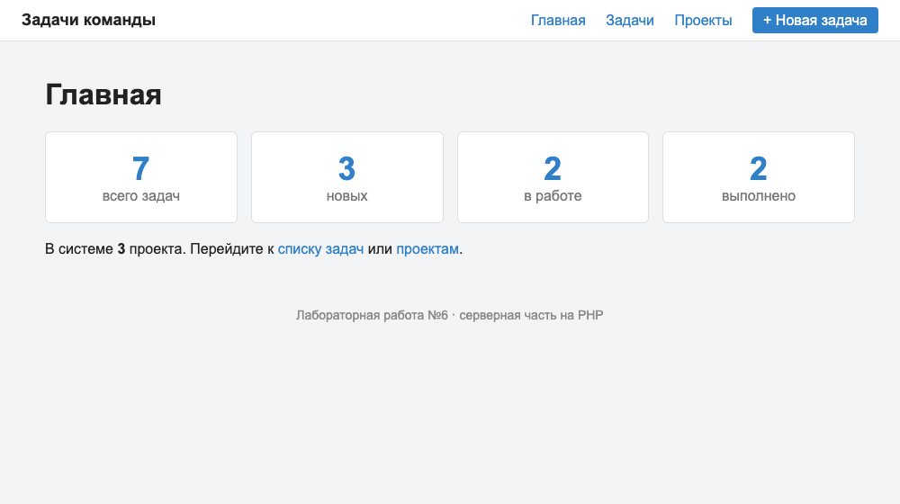
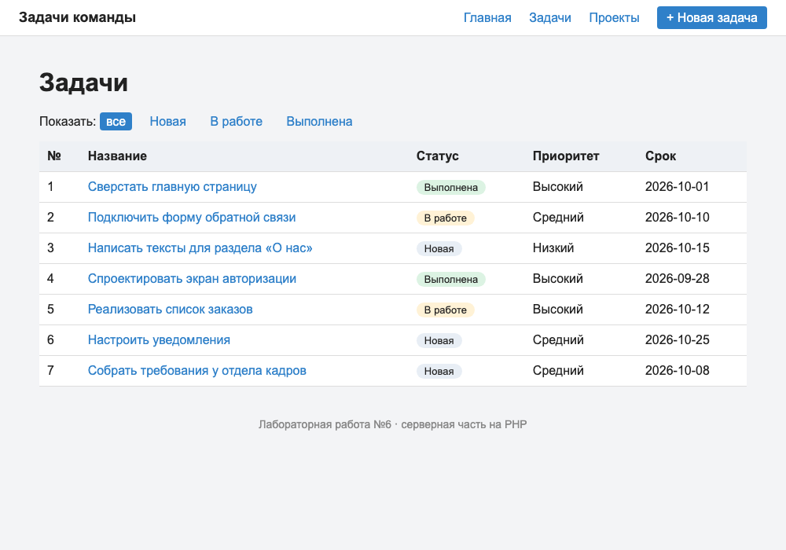
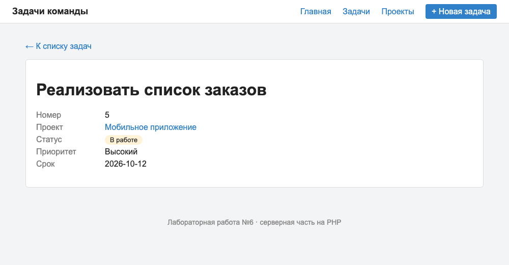
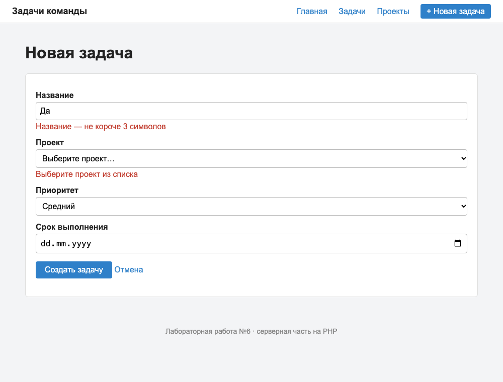
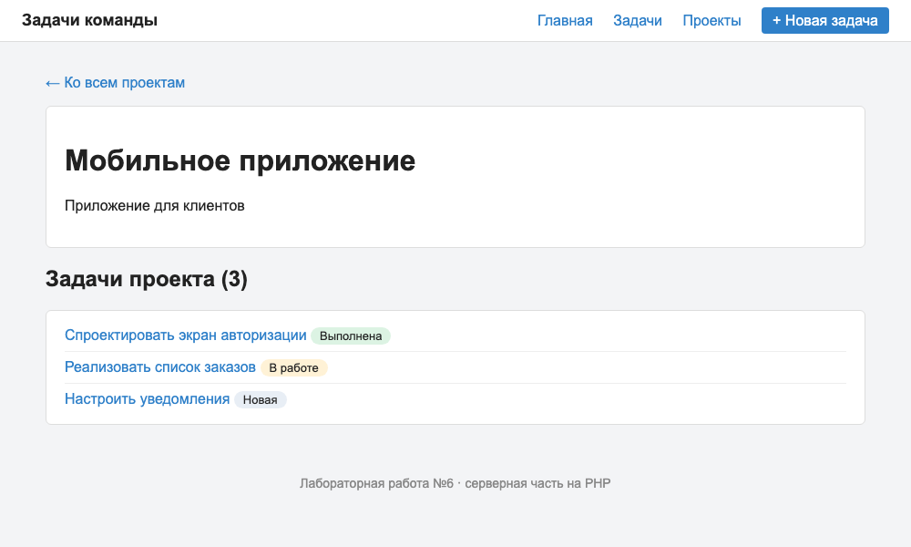
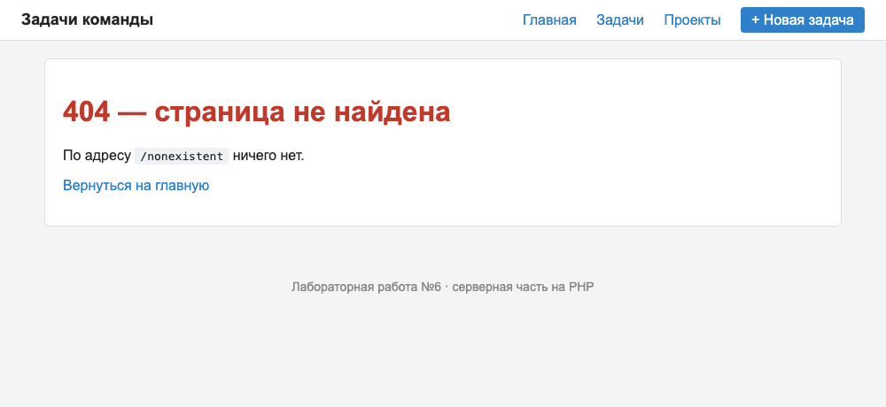

# Лабораторная работа №6
## Разработка серверной части приложения

### Цель работы

Изучить основы разработки серверной части веб-приложений на PHP, создать структуру проекта, реализовать маршрутизацию HTTP-запросов и разработать контроллеры для обработки запросов пользователей.

---

## Краткое описание выполненного задания

На основе архитектуры системы «Система управления задачами команды» (лабораторные работы №3–5) создана основа серверной части приложения на PHP 8.2 по паттерну MVC: единая точка входа, собственный маршрутизатор, три контроллера, модели и HTML-шаблоны. Сервер отвечает страницами: главная со сводкой, список задач с фильтром, просмотр задачи, форма создания, список проектов и просмотр проекта.

Данные хранятся в JSON-файлах (`src/storage/`), работа с ними вынесена в модели. База данных будет подключена в следующих работах: контроллеры и шаблоны при этом менять не потребуется.

## Предметная область

Демонстрационный вариант 0: «Система управления задачами команды» (в вашей работе здесь заполненная карточка вашей предметной области и 2–3 предложения о переносе: что изменили и как проверили).

| Что определить | Значение |
|----------------|----------|
| Основная сущность | задача (`task`, `tasks`) |
| Связанная сущность | проект (`project`, `projects`) |
| Поля основной сущности | `id`, `project_id`, `title`, `status`, `priority`, `due_date` |
| Поле для фильтра | `status`: `new`, `in_progress`, `done` |
| Поля связанной сущности | `id`, `title`, `description` |
| Данные | 7 задач, 3 проекта (`storage/tasks.json`, `storage/projects.json`) |

---

**Запуск:**

```bash
cd lab6/src
php -S localhost:8000 -t public
```

Открыть `http://localhost:8000`.

---

## Описание структуры проекта

```
src/
├── public/                       # единственная папка, доступная из интернета
│   ├── index.php                 # единая точка входа (front controller)
│   └── css/style.css
├── app/
│   ├── autoload.php              # автозагрузка классов по пространству имён
│   ├── helpers.php               # функции e(), view(), redirect(), notFound(), config()
│   ├── Core/Router.php           # маршрутизатор
│   ├── Controllers/              # HomeController, TaskController, ProjectController
│   ├── Models/                   # TaskRepository, ProjectRepository
│   └── Views/                    # шаблоны: layout/, errors/, tasks/, projects/, home.php
├── routes/web.php                # таблица маршрутов
├── config/app.php                # настройки
└── storage/                      # данные: tasks.json, projects.json
```

| Каталог | Назначение |
|---------|------------|
| `public/` | точка входа и статические файлы. Только эта папка открыта серверу (`-t public`), поэтому код и данные недоступны по прямому адресу |
| `app/Controllers/` | контроллеры: принимают запрос, обращаются к моделям, выбирают шаблон |
| `app/Models/` | модели: единственное место, которое знает, где и как хранятся данные |
| `app/Views/` | шаблоны страниц (PHP внутри HTML), общая шапка и подвал вынесены в `layout/` |
| `app/Core/` | ядро приложения: маршрутизатор |
| `routes/` | таблица соответствия «адрес — контроллер и метод» |
| `config/` | настройки приложения |
| `storage/` | файлы с данными |

Классы подключаются автоматически: функция `spl_autoload_register` по имени класса `App\Controllers\TaskController` находит файл `app/Controllers/TaskController.php`, поэтому в коде нет ни одного `require` для классов.

---

## Описание механизма маршрутизации

Все запросы направляются в `public/index.php` (front controller). Он подключает автозагрузку и вспомогательные функции, создаёт `Router`, загружает таблицу маршрутов `routes/web.php` и передаёт маршрутизатору метод и адрес запроса.

Таблица маршрутов:

| Метод | Адрес | Контроллер и метод | Назначение |
|-------|-------|--------------------|------------|
| GET | `/` | `HomeController::index` | главная страница |
| GET | `/tasks` | `TaskController::index` | список задач (фильтр `?status=`) |
| GET | `/tasks/create` | `TaskController::create` | форма создания |
| POST | `/tasks` | `TaskController::store` | приём формы |
| GET | `/tasks/{id}` | `TaskController::show` | просмотр задачи |
| GET | `/projects` | `ProjectController::index` | список проектов |
| GET | `/projects/{id}` | `ProjectController::show` | проект и его задачи |

Алгоритм `Router::dispatch()`:

1. Из адреса `/tasks/5?status=done` выделяется путь `/tasks/5`.
2. Маршруты просматриваются **по порядку**. Пропускаются маршруты с другим методом.
3. Для маршрута с подходящим методом метод `match()` превращает шаблон `/tasks/{id}` в регулярное выражение и возвращает параметры (`['id' => '5']`) или `null`, если адрес не подошёл.
4. Для подошедшего маршрута создаётся объект контроллера, и вызывается его метод, а параметры из адреса передаются как именованные аргументы (`show(string $id)`).
5. Если подходящего маршрута нет, возвращается страница 404 с кодом ответа 404.

Порядок регистрации важен: маршрут `/tasks/create` зарегистрирован выше `/tasks/{id}`. Иначе слово `create` было бы принято за номер задачи.

Ошибки выполнения (исключения) перехватываются в `public/index.php`: приложение возвращает код 500 и страницу ошибки. Подробный текст ошибки показывается только при `debug = true` в `config/app.php`.

---

## Описание реализованных контроллеров

| Контроллер | Метод | Что делает |
|------------|-------|------------|
| `HomeController` | `index` | считает задачи по статусам и проекты, показывает главную |
| `TaskController` | `index` | список задач; при `?status=done` оставляет только выбранный статус |
| | `show($id)` | одна задача и её проект; если задачи нет, страница 404 |
| | `create` | форма создания с выпадающим списком проектов |
| | `store` | читает `$_POST`, проверяет данные на сервере; при ошибках показывает форму с подсказками и кодом 422, иначе сохраняет задачу и перенаправляет на `/tasks` (код 302) |
| `ProjectController` | `index` | список проектов |
| | `show($id)` | проект и список его задач; если проекта нет, страница 404 |

Передача данных между слоями:
- **маршрутизатор → контроллер:** параметры адреса (`{id}`) как аргументы метода;
- **запрос → контроллер:** `$_GET` (фильтр) и `$_POST` (форма);
- **контроллер → шаблон:** функция `view('tasks/show', ['task' => $task, ...])`, ключи массива становятся переменными в шаблоне;
- **модель → контроллер:** массивы данных (`all()`, `find()`, `byProject()`, `add()`).

Все значения в шаблонах выводятся через функцию `e()` (`htmlspecialchars`), поэтому внедрить HTML-код через название задачи невозможно (проверено на строке `<script>alert(1)</script>`).

### Проверка работы приложения

| Запрос | Результат |
|--------|-----------|
| `GET /` | 200, карточки: 7 задач, 3 новых, 2 в работе, 2 выполнено |
| `GET /tasks` | 200, 7 строк |
| `GET /tasks?status=done` | 200, 2 строки |
| `GET /tasks?status=zzz` | 200, сообщение «Задачи не найдены» |
| `GET /tasks/3` | 200, задача №3 и название проекта |
| `GET /tasks/999`, `GET /tasks/abc` | 404 |
| `GET /tasks/create` | 200, форма (маршрут не перехвачен шаблоном `{id}`) |
| `POST /tasks` с названием «Да» без проекта | 422, подсказки у полей, введённое значение сохранено |
| `POST /tasks` с приоритетом `urgent` | 422 |
| `POST /tasks` с корректными данными | 302 → 200 на `/tasks`, задача №8 в списке и в `storage/tasks.json` |
| `GET /projects/2` | 200, проект и 3 его задачи |
| `GET /projects/99`, `GET /nonexistent` | 404 |
| `POST /projects` | 404 (для адреса есть только маршрут GET) |
| `GET /css/style.css` | 200 (статика отдаётся сервером напрямую) |
| исключение в контроллере | 500, страница ошибки |

#### Главная страница


#### Список задач


#### Просмотр задачи


#### Форма создания с ошибками проверки (код 422)


#### Просмотр проекта


#### Несуществующий адрес (код 404)


---

## Вывод

В результате работы создана основа серверной части приложения на PHP по паттерну MVC: определена структура проекта, реализован маршрутизатор, который регистрирует маршруты, выбирает контроллер по методу и адресу, передаёт ему параметры из адреса и возвращает страницу 404 для несуществующих маршрутов. Разработаны три контроллера, обрабатывающие основные сценарии: просмотр главной страницы, списков и отдельных объектов, создание объекта через форму с проверкой данных на сервере. Разделение на модели, представления и контроллеры позволит заменить файл базой данных и добавить REST API, не переписывая остальной код.

---

**Структура репозитория:**
```
lab6/
├── README.md
├── src/          # исходный код (см. «Описание структуры проекта»)
└── images/
    ├── 01-home.png
    ├── 02-tasks.png
    ├── 03-task.png
    ├── 04-create-errors.png
    ├── 05-404.png
    └── 06-project.png
```
